### Hi there 👋

<picture>
  <source media="(prefers-color-scheme: dark)"
          srcset="./docs/assets/readme_stats_dark.svg" />
  <source media="(prefers-color-scheme: light)"
          srcset="./docs/assets/readme_stats_light.svg" />
  
</picture>

- 🤿 I'm **umatare5**, also known as **@ram**
- 🏡 Based in **Okinawa, Japan**
- 🌐 Network-focused **SRE**
- 🌊 Love the beautiful ocean
- 📚️ Check out the [About](https://dives.dev/about) on my logbook

